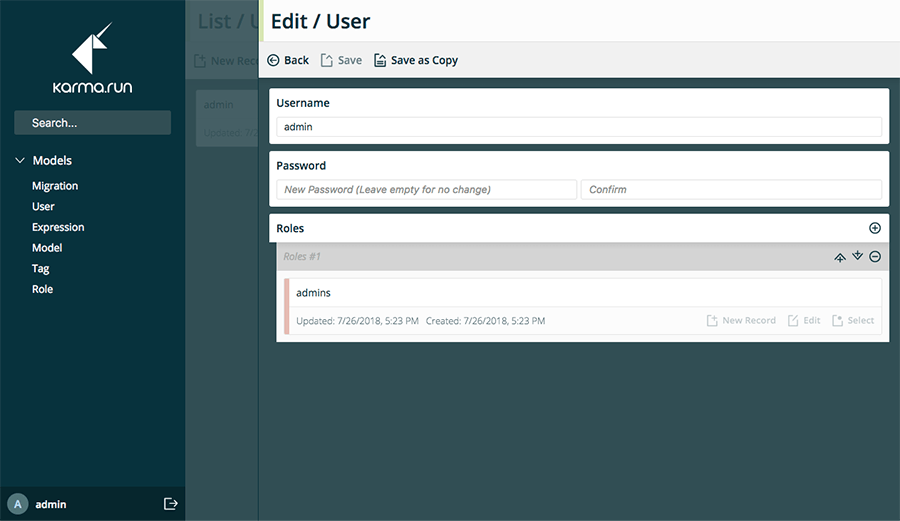

# karma.data / Editor

[![License][license_shield]][license_link]
[![NPM Package][npm_shield]][npm_link]

Administrative editor for karma.data.



## Install

```sh
npm install -g @karma.run/editor
```

## Basic Usage

```sh
$ karma-editor --help

  Usage: karma-editor [options] [command]

  Options:

    -V, --version     output the version number
    -h, --help        output usage information

  Commands:

    server [options]  Run editor server.
    build [options]   Pre-build editor client.
    clean [options]   Clean client cache.
```

## Configuration Files

Configuration files allow the usage of plugins and advanced customization of the editor, they can be written in JavaScript or TypeScript.

The CLI will automatically search for `editor.client.config.{js,ts,tsx}` and `editor.server.config.{js,ts,tsx}` upwards from the current working directory, if you'd rather be specific you can always set the config path manually via CLI option `--server-config-path` and `--client-config-path`.

**NOTICE: It's recommended to have both configuration files in the same directory**

### Client Configuration

### Server Configuration

[license_shield]: https://img.shields.io/github/license/karmarun/karma.tools.svg
[license_link]: https://github.com/karmarun/karma.tools/blob/master/LICENSE
[npm_shield]: https://img.shields.io/npm/v/@karma.run/editor.svg
[npm_link]: https://www.npmjs.com/package/@karma.run/editor
